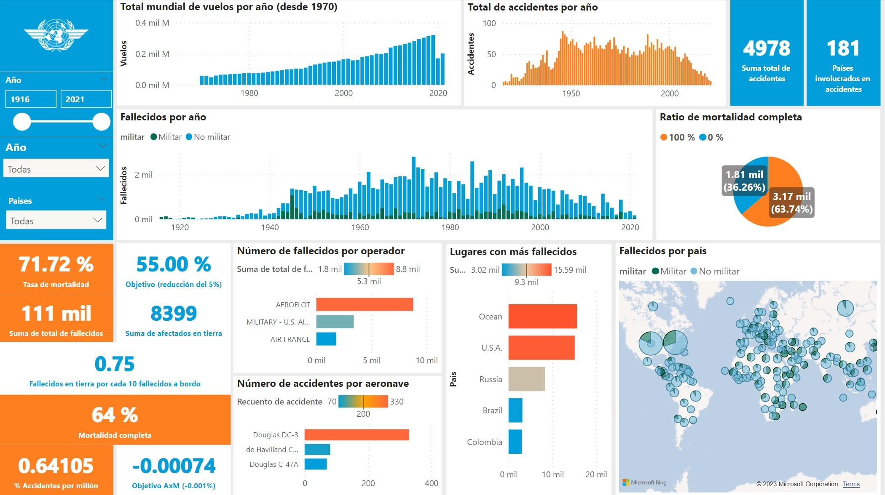

# **Accidentes aéreos**
*Proyecto de Data Analytics con Python y PowerBI*

 
*Foto de <a href="https://unsplash.com/@ugmonk?utm_source=unsplash&utm_medium=referral&utm_content=creditCopyText">Jeff Sheldon</a> en <a href="https://unsplash.com/es/fotos/uWwN03Mg4Wg?utm_source=unsplash&utm_medium=referral&utm_content=creditCopyText">Unsplash</a>*

 

 

## **Índice de archivos**

- **Dashboard.pbix**  
Archivo PowerBI para interactuar con las visualizaciones de los datos, segmentando por año, país, número de fallecidos, operador, etc.
- **README.md**  (Usted está aquí) 
Archivo de texto con el reporte escrito y una guía de navegación por los archivos del proyecto.
- **EDA.ipynb**  
Archivo Jupyter Notebook con las transformaciones, limpieza de los datos, análisis exploratorio, visualizaciones preliminares y preparación para la visualización en PowerBI
- **API_IS.AIR.DPRT_DS2_en_csv_v2_5462238.csv**  
Archivo de datos complementarios con los registros de vuelos despegados por país. Recogido de la web del Banco Mundial.
- **accidentes.csv**  
Archivo resultante de EDA.ipynb, con los registros de accidentes
- **total_vuelos.csv**  
Archivo resultante de EDA.ipynb, con los registros de vuelos a nivel mundial
- **AccidentesAviones.csv**  
Primer archivo recibido, antes de toda la limpieza y transformaciones
- **src** - carpeta  
Imágenes de apoyo <3

 

 

## **Contexto**
Los accidentes aéreos son eventos que acompañan a la aeronáutica casi desde sus inicios, sus causas son siempre variadas, y en algunos casos, impredecibles; causando enormes pérdidas de tipo económico, y lo que es peor, de vidas humanas.

Es de gran importancia recopilar información sobre estos eventos, con la finalidad de estudiarlos, detectar patrones, correlaciones o tendencias para así mejorar las decisiones que se toman en favor de la seguridad aeronáutica y optimizar todos los aspectos gestionables que permitan trasladar con seguridad a tripulantes y pasajeros.

Para este estudio tuve a disposición un set de datos conformado por registros de todas las ocurrencias de accidentes aéreos, desde el primer accidente mortal registrado en la historia de la aviación (en 1908), hasta mediados de 2021.

 

 

## **Proceso**
Los datos iniciales requerían un proceso de limpieza y preparación antes de comenzar con el estudio. Aquí las etapas de la preparación:

- Eliminación de columnas poco relevantes, con información ambigua o imprecisa
- Gestión de datos nulos
- Normalización del formato de las fechas
- Cálculo del número de sobrevivientes por accidente
- Extracción de la ubicación geográfica de los accidentes (contenida en la ruta de vuelo) por medio de expresiones regulares
- Para contextualizar y poner las métricas en perspectiva, complementé los datos con otro dataset, con información de todos los vuelos que despegan a en todo el mundo, provisto por el Banco Mundial:
[https://data.worldbank.org/indicator/IS.AIR.DPRT?end=2016&start=1970&view=chart](https://data.worldbank.org/indicator/IS.AIR.DPRT?end=2016&start=1970&view=chart)
- Análisis exploratorio de los datos
- Creación de un nuevo archivo para el análisis y generación de visualizaciones

**IMPORTANTE: Algunos registros no contenían datos de la cantidad de fallecidos en el accidente, estos valores nulos fueron reemplazados con -1 con el objetivo de no combinar estos valores con los de los accidentes donde no hubieron pérdidas humanas, evitando así la generación de información falsa.**

*Para revisar todo el proceso a detalle, junto con un análisis estadístico preliminar, visita el archivo EDA.ipynb*

 

 

## **Indicadores Clave (KPI)**
Se plantean 4 KPIs, uno de ellos solicitado por el cliente:

**1. Tasa de Mortalidad Anual:**
El objetivo es reducir este indicador en un 5% con respecto al año anterior
 
 
$$
\frac{Total de Fallecidos}{Total de Personas a Bordo} *100
$$

 

**2. Fallecidos en tierra por cada 10 fallecidos a bordo:**
Indica cuántas personas murieron en tierra por cada 10 fallecidos a bordo. Es útil para detectar accidentes que provocan daños y pérdidas humanas en tierra y calcular daños fuera de la aeronave, como por ejemplo, en el caso de accidentes provocados.
 
 

$$
\frac{Total de Fallecidos en Tierra}{Total de Fallecidos a Bordo} * 10
$$

 

**3. Tasa de mortalidad completa:**
Indica el porcentaje de accidentes en los que todas las personas a bordo murieron.
 
$$
\frac
{Accidentes con Mortalidad Total}{Total de accidentes}*100
$$
 

**4. Accidentes por Millón:**
Indica la proporción de vuelos accidentados por cada millón de vuelos que despegaron. El objetivo para este indicador es reducirse en un 0.001% con respecto al año anterior
 
$$
\frac{Total de vuelos accidentados}{Total de vuelos}* 10^5
$$
 

 

 
*Visita el archivo Dashboard.pbix para interactuar con las segmentaciones de los datos*

 

 

## **Insights**
- La cantidad anual de accidentes aéreos se reduce cada año, a pesar de que la cantidad de vuelos que despegan no deja de crecer.
- Después de 2001, la tasa de accidentes tuvo una caída significativa que continúa hasta la actualidad.
- El operador que más fallecidos tuvo en la historia es Aeroflot, que opera en Rusia.
- En los últimos 20 años el operador con más fallecidos es la fuerza aérea de Indonesia.
- En los últimos 10 años, el operador con más fallecidos es Malaysia Airlines.
- La mayor parte de los accidentes ocurren en el océano.
- En los últimos 50 años, ocurrieron 3 accidentes por cada 10 millones de vuelos que despegaron.
- En los últimos 50 años, en el 62% de los vuelos que se accidentan, mueren todas las personas a bordo.
- En los últimos 50 años, por cada 10 fallecidos a bordo mueren 1.1 personas en tierra.
- En toda la historia, la tasa de mortalidad de accidentes relacionados a aeronaves de tipo militar nunca está por debajo del 90%, mientras que los accidentes de tipo no militar tienen una mortalidad promedio del 68.5%. 
- El accidente con mayor cantidad de fallecidos en tierra de toda la historia de la aviación fue la tragedia del 11 de septiembre.

 

 

## **Conclusiones**
- Cuando una aeronave sufre un accidente, poco se puede hacer para reducir la mortalidad (dada la tasa de accidentes con una mortalidad total).
- Después de 2001, existe una notable reducción en el indicador de accidentes por millón de vuelos. Podemos relacionar directamente esta mejora con la implentación de protocolos más estrictos de seguridad aeronáutica y visualizar en una gráfica el impacto a nivel mundial que tuvo este atentado.
- Cuando se presentan conflictos armados, estos pueden llegar a ocasionar hasta un 64% de las muertes relacionadas a accidentes aéreos en el año.
- Estados Unidos, Rusia e Indonesia se mantienen como los 3 países con más fallecidos a nivel mundial desde 1963.

 

 

## **Recomendaciones**
- Para cumplir el objetivo primordial de preservación de vidas humanas resulta más eficiente mejorar la métrica de AxM (Accidentes por Millón) en lugar de la tasa de mortalidad de los accidentes.
- Sin embargo, dada la alta incidencia de accidentes que ocurren en el océano, optimizar los protocolos de acuatización y comunicación con tierra para operaciones de rescate marino puede contribuir a reducir la mortalidad en estos accidentes.

